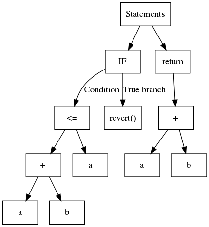

## Static analysis

The capabilities and design of the Slither static analysis framework have been described in blog posts ([1](https://blog.trailofbits.com/2018/10/19/slither-a-solidity-static-analysis-framework/), [2](https://blog.trailofbits.com/2019/05/27/slither-the-leading-static-analyzer-for-smart-contracts/)) and an [academic paper](https://github.com/trailofbits/publications/blob/master/papers/wetseb19.pdf).

Static analysis comes in different flavors. You may already know that compilers like [clang](https://clang-analyzer.llvm.org/) and [gcc](https://lwn.net/Articles/806099/) rely on these research techniques, as do tools like [Infer](https://fbinfer.com/), [CodeClimate](https://codeclimate.com/), [FindBugs](http://findbugs.sourceforge.net/), and tools based on formal methods like [Frama-C](https://frama-c.com/) and [Polyspace](https://www.mathworks.com/products/polyspace.html).

In this article, we will not provide an exhaustive review of static analysis techniques and research. Instead, we'll focus on what you need to understand about how Slither works, so you can more effectively use it to find bugs and understand code.

- [Code representation](#code-representation)
- [Code analysis](#analysis)
- [Intermediate representation](#intermediate-representation)

### Code representation

Unlike dynamic analysis, which reasons about a single execution path, static analysis reasons about all paths at once. To do so, it relies on a different code representation. The two most common ones are the abstract syntax tree (AST) and the control flow graph (CFG).

### Abstract Syntax Trees (AST)

ASTs are used every time a compiler parses code. They are arguably the most basic structure upon which static analysis can be performed.

In a nutshell, an AST is a structured tree where, usually, each leaf contains a variable or a constant, and internal nodes are operands or control flow operations. Consider the following code:

```solidity
function safeAdd(uint256 a, uint256 b) internal pure returns (uint256) {
    if (a + b <= a) {
        revert();
    }
    return a + b;
}
```

The corresponding AST is shown in the following illustration:



Slither uses the AST exported by solc.

While simple to build, the AST is a nested structure that's not always straightforward to analyze. For example, to identify the operations used by the expression `a + b <= a`, you must first analyze `<=` and then `+`. A common approach is to use the so-called visitor pattern, which navigates through the tree recursively. Slither contains a generic visitor in [`ExpressionVisitor`](https://github.com/crytic/slither/blob/master/slither/visitors/expression/expression.py).

The following code uses `ExpressionVisitor` to detect if an expression contains an addition:

```python
from slither.visitors.expression.expression import ExpressionVisitor
from slither.core.expressions.binary_operation import BinaryOperationType

class HasAddition(ExpressionVisitor):

    def result(self):
        return self._result

    def _post_binary_operation(self, expression):
        if expression.type == BinaryOperationType.ADDITION:
            self._result = True

visitor = HasAddition(expression) # expression is the expression to be tested
print(f'The expression {expression} has an addition: {visitor.result()}')
```

### Control Flow Graph (CFG)

The second most common code representation is the control flow graph (CFG). As its name suggests, it is a graph-based representation that reveals all the execution paths. Each node contains one or multiple instructions, and edges in the graph represent control flow operations (if/then/else, loop, etc). The CFG of our previous example is as follows:


Most analyses are built on top of the CFG representation.

There are many other code representations, each with its advantages and drawbacks depending on the desired analysis.

### Analysis

The simplest types of analyses that can be performed with Slither are syntactic analyses.

### Syntax analysis

Slither can navigate through the different components of the code and their representation to find inconsistencies and flaws using a pattern matching-like approach.

For example, the following detectors look for syntax-related issues:

- [State variable shadowing](../detectors/Detector-Documentation.md#state-variable-shadowing): iterates over all state variables and checks if any shadow a variable from an inherited contract ([state.py#L51-L62](https://github.com/crytic/slither/blob/0441338e055ab7151b30ca69258561a5a793f8ba/slither/detectors/shadowing/state.py#L51-L62))

- [Incorrect ERC20 interface](./detectors/Detector-Documentation.md#incorrect-erc20-interface): searches for incorrect ERC20 function signatures ([incorrect_erc20_interface.py#L34-L55](https://github.com/crytic/slither/blob/0441338e055ab7151b30ca69258561a5a793f8ba/slither/detectors/erc/incorrect_erc20_interface.py#L34-L55))

### Semantic analysis

In contrast to syntax analysis, semantic analysis delves deeper and analyzes the "meaning" of the code. This category includes a broad range of analyses that yield more powerful and useful results but are more complex to write.

Semantic analyses are used for advanced vulnerability detection.

#### Data dependency analysis

A variable `variable_a` is said to be data-dependent on `variable_b` if there is a path for which the value of `variable_a` is influenced by `variable_b`.

In the following code, `variable_a` is dependent on `variable_b`:

```solidity
// ...
variable_a = variable_b + 1;
```

Slither comes with built-in [data dependency](./Data-dependency.md) capabilities, thanks to its intermediate representation (discussed later).

An example of data dependency usage can be found in the [dangerous strict equality detector](./detectors/Detector-Documentation.md#dangerous-strict-equalities). Slither looks for strict equality comparisons to dangerous values ([incorrect_strict_equality.py#L86-L87](https://github.com/crytic/slither/blob/6d86220a53603476f9567c3358524ea4db07fb25/slither/detectors/statements/incorrect_strict_equality.py#L86-L87)) and informs the user that they should use `>=` or `<=` instead of `==` to prevent attackers from trapping the contract. Among other things, the detector considers the return value of a call to `balanceOf(address)` to be dangerous ([incorrect_strict_equality.py#L63-L64](https://github.com/crytic/slither/blob/6d86220a53603476f9567c3358524ea4db07fb25/slither/detectors/statements/incorrect_strict_equality.py#L63-L64)) and uses the data dependency engine to track its usage.

#### Fixed-point computation

If your analysis navigates through the CFG and follows the edges, you're likely to encounter already visited nodes. For example, if a loop is presented as shown below:

```solidity
for(uint256 i; i < range; ++) {
    variable_a += 1;
}
```

Your analysis will need to know when to stop. There are two main strategies: (1) iterate on each node a finite number of times, (2) compute a so-called _fixpoint_. A fixpoint essentially means that analyzing the node doesn't provide any meaningful information.

An example of a fixpoint used can be found in the reentrancy detectors: Slither explores the nodes and looks for external calls, reads, and writes to storage. Once it has reached a fixpoint ([reentrancy.py#L125-L131](https://github.com/crytic/slither/blob/master/slither/detectors/reentrancy/reentrancy.py#L125-L131)), it stops the exploration and analyzes the results to see if a reentrancy is present, through different reentrancy patterns ([reentrancy_benign.py](https://github.com/crytic/slither/blob/b275bcc824b1b932310cf03b6bfb1a1fef0ebae1/slither/detectors/reentrancy/reentrancy_benign.py), [reentrancy_read_before_write.py](https://github.com/crytic/slither/blob/b275bcc824b1b932310cf03b6bfb1a1fef0ebae1/slither/detectors/reentrancy/reentrancy_read_before_write.py), [reentrancy_eth.py](https://github.com/crytic/slither/blob/b275bcc824b1b932310cf03b6bfb1a1fef0ebae1/slither/detectors/reentrancy/reentrancy_eth.py)).

Writing analyses using efficient fixed-point computation requires a good understanding of how the analysis propagates its information.

### Intermediate representation

An intermediate representation (IR) is a language designed to be more amenable to static analysis than the original one. Slither translates Solidity to its own IR: [SlithIR](./SlithIR.md).

Understanding SlithIR is not necessary if you only want to write basic checks. However, it becomes essential if you plan to write advanced semantic analyses. The [SlithIR](../printers/Printer-documentation.md#slithir) and [SSA](../printers/Printer-documentation.md#slithir-ssa) printers can help you understand how the code is translated.
